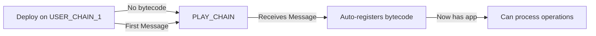
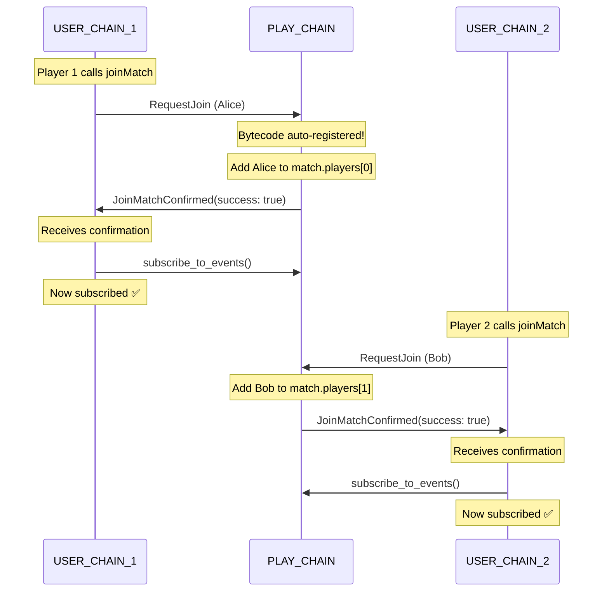
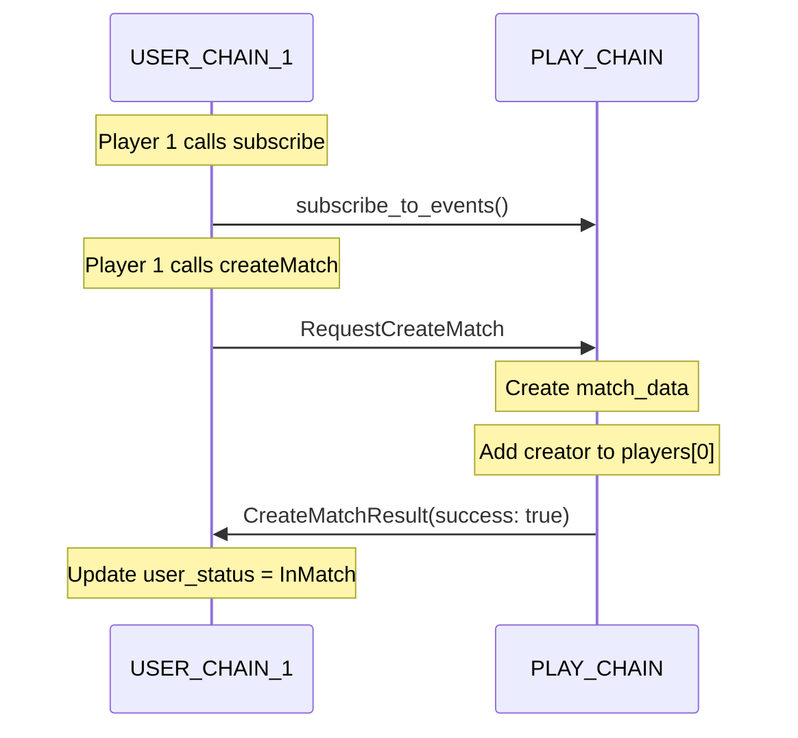
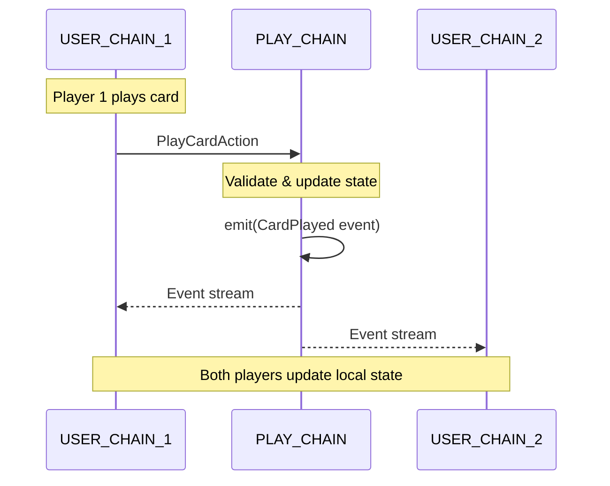

# Linot Backend Working Flow

> **Last Updated:** 2026-01-03  
> **Status:** ✅ Working - Subscribe pattern implementation successful

## Table of Contents
1. [The Core Problem](#the-core-problem)
2. [How Linera Works](#how-linera-works)
3. [The Solution: Inspo Pattern](#the-solution-inspo-pattern)
4. [Backend Architecture](#backend-architecture)
5. [Implementation Changes](#implementation-changes)
6. [Message Flow Diagrams](#message-flow-diagrams)
7. [Testing & Verification](#testing--verification)
8. [Future Implementation Guide](#future-implementation-guide)

---

## The Core Problem

### Original Issue
**Error:** `"client is not configured to propose on chain"`

### What Was Happening
```rust
// BROKEN APPROACH
USER_CHAIN: subscribe(PLAY_CHAIN)  
            ↓
PLAY_CHAIN: ❌ ERROR - application bytecode not found!
```

The subscribe operation tried to register with PLAY_CHAIN **before** the application bytecode was available there.

### Root Cause
Linera applications are deployed on one chain initially. Other chains don't have the application bytecode until they receive a cross-chain message related to that application.

---

## How Linera Works

### Application Bytecode Propagation



**Key Insight:** The **first cross-chain message** to a new chain automatically propagates the application bytecode to that chain.

### Chain Types in Linot

1. **USER_CHAIN** (Player-specific)
   - Stores player's local state
   - Sends operations to PLAY_CHAIN
   - Subscribes to PLAY_CHAIN events

2. **PLAY_CHAIN** (Authoritative game state)
   - Holds the match data
   - Processes game logic
   - Emits events to subscribers

---

## The Solution: Inspo Pattern

Inspired by the `inspo` reference implementation, we moved subscription to **after** receiving confirmation from PLAY_CHAIN.

### The Working Flow

```rust
// ✅ WORKING APPROACH
1. USER_CHAIN: Send RequestJoin message → PLAY_CHAIN
2. PLAY_CHAIN: Receives message (bytecode auto-registered!)
3. PLAY_CHAIN: Processes join → Sends JoinMatchConfirmed back
4. USER_CHAIN: Receives confirmation → NOW subscribes!
```

---

## Backend Architecture

### File Structure

```
backend/src/
├── contract.rs           # Main contract logic, execute_operation & execute_message
├── service.rs            # GraphQL service, queries
├── lib.rs               # Types (Operation, Message, UserStatus, etc.)
├── state.rs             # State definitions
└── chains/
    ├── user_chain.rs    # USER_CHAIN-specific handlers
    └── play_chain.rs    # PLAY_CHAIN-specific handlers
```

### Chain Responsibilities

#### USER_CHAIN (`user_chain.rs`)
- **Operations:** `subscribe`, `joinMatch`, `createMatch`, `playCard`, `drawCard`
- **Purpose:** Send messages to PLAY_CHAIN
- **State:** Local copy of match data (via events), subscription status

#### PLAY_CHAIN (`play_chain.rs`)
- **Messages:** `RequestJoin`, `RequestCreateMatch`, `StartMatchAction`, etc.
- **Purpose:** Authoritative game state and logic
- **State:** Master `match_data`, deck, players, game status

---

## Implementation Changes

### 1. Added New UserStatus Variant

**File:** `backend/src/lib.rs`

```rust
pub enum UserStatus {
    Idle,
    CreatingMatch,
    WaitingToJoin,  // ← NEW: Waiting for join confirmation
    InMatch,
    WaitingForPlayers,
}
```

**Purpose:** Track that user is waiting for PLAY_CHAIN confirmation before subscribing.

---

### 2. Added JoinMatchConfirmed Message

**File:** `backend/src/lib.rs`

```rust
pub enum Message {
    // ... existing messages
    
    /// PLAY_CHAIN -> USER_CHAIN: Confirm join was successful (triggers subscribe)
    JoinMatchConfirmed {
        play_chain_id: ChainId,
        success: bool,
    },
    
    // ...
}
```

**Purpose:** PLAY_CHAIN sends this back to USER_CHAIN to confirm join and trigger subscription.

---

### 3. Modified `handle_join_match`

**File:** `backend/src/chains/user_chain.rs`

**Before:**
```rust
pub async fn handle_join_match(&mut self, play_chain_id: ChainId, nickname: String) {
    let message = Message::RequestJoin { ... };
    self.runtime.prepare_message(message).send_to(play_chain_id);
    
    // ❌ BROKEN: Subscribe immediately
    self.runtime.subscribe_to_events(play_chain_id, app_id, GAME_STREAM_NAME.into());
    self.state.subscribed_play_chain.set(Some(play_chain_id));
    self.state.user_status.set(UserStatus::InMatch);
}
```

**After:**
```rust
pub async fn handle_join_match(&mut self, play_chain_id: ChainId, nickname: String) {
    let message = Message::RequestJoin { ... };
    self.runtime.prepare_message(message).send_to(play_chain_id);
    
    // ✅ FIXED: Don't subscribe yet!
    self.state.player_nickname.set(Some(nickname));
    self.state.user_status.set(UserStatus::WaitingToJoin);  // Wait for confirmation
}
```

**Critical Change:** Removed immediate subscribe, added `WaitingToJoin` status.

---

### 4. Added `handle_join_confirmed`

**File:** `backend/src/chains/user_chain.rs`

```rust
/// Handle join confirmation from PLAY_CHAIN - THIS IS WHERE WE SUBSCRIBE!
pub async fn handle_join_confirmed(&mut self, play_chain_id: ChainId, success: bool) {
    if !success {
        log::warn!("USER_CHAIN: Join was rejected by PLAY_CHAIN");
        self.state.user_status.set(UserStatus::Idle);
        return;
    }

    // ✅ NOW we subscribe - after PLAY_CHAIN has confirmed the join
    let app_id = self.runtime.application_id().forget_abi();
    self.runtime.subscribe_to_events(
        play_chain_id,
        app_id,
        GAME_STREAM_NAME.into()
    );

    // Update local state
    self.state.subscribed_play_chain.set(Some(play_chain_id));
    self.state.user_status.set(UserStatus::InMatch);

    log::info!("USER_CHAIN: ✅ Subscribed to PLAY_CHAIN {:?} after join confirmation", play_chain_id);
}
```

**Purpose:** Subscribe to PLAY_CHAIN **after** receiving confirmation that join was successful.

---

### 5. Added Message Handler

**File:** `backend/src/contract.rs`

```rust
async fn execute_message(&mut self, message: Self::Message) {
    match message {
        // ... existing handlers
        
        // USER_CHAIN: Confirmation of join from PLAY_CHAIN (triggers subscribe!)
        Message::JoinMatchConfirmed {
            play_chain_id,
            success,
        } => {
            self.handle_join_confirmed(play_chain_id, success).await;
        }
        
        // ...
    }
}
```

**Purpose:** Route the confirmation message to the handler.

---

### 6. Modified PLAY_CHAIN Join Handler

**File:** `backend/src/chains/play_chain.rs`

```rust
pub async fn handle_request_join_message(
    &mut self,
    player_owner: AccountOwner,
    player_chain: ChainId,
    nickname: String
) {
    let play_chain_id = self.runtime.chain_id();
    let match_data = self.state.match_data.get_mut();

    if let Some(index) = match_data.players.iter().position(|p| p.is_none()) {
        // Add player to match
        let player = Player::new(player_chain, player_owner, nickname.clone());
        match_data.players[index] = Some(player);

        // ✅ NEW: Send confirmation back to USER_CHAIN
        let confirmation = Message::JoinMatchConfirmed {
            play_chain_id,
            success: true,
        };
        self.runtime.prepare_message(confirmation).send_to(player_chain);

        // Emit event
        self.emit_event(GameEvent::PlayerJoined {
            nickname,
            player_count: match_data.players.iter().filter(|p| p.is_some()).count(),
        });
    } else {
        // ✅ NEW: Send failure confirmation
        let confirmation = Message::JoinMatchConfirmed {
            play_chain_id,
            success: false,
        };
        self.runtime.prepare_message(confirmation).send_to(player_chain);
    }
}
```

**Critical Addition:** PLAY_CHAIN now sends confirmation message back, triggering subscribe on USER_CHAIN.

---

## Message Flow Diagrams

### Complete Join Flow



### Create Match Flow



### Game Action Flow



---

## Testing & Verification

### Correct Mutation Sequence

**Player 1:**
```graphql
# Step 1: Subscribe to PLAY_CHAIN
mutation {
  subscribe(playChainId: "<PLAY_CHAIN_ID>")
}

# Step 2: Create match
mutation {
  createMatch(maxPlayers: 2, nickname: "Alice")
}
```

**Player 2:**
```graphql
# Join match (auto-subscribes via confirmation)
mutation {
  joinMatch(playChainId: "<PLAY_CHAIN_ID>", nickname: "Bob")
}
```

**Either Player:**
```graphql
mutation {
  startMatch
}
```

### Verifying Success

**Query PLAY_CHAIN:**
```graphql
query {
  matchState {
    status
    players {
      nickname
      handSize
    }
  }
}
```

**Expected:**
```json
{
  "data": {
    "matchState": {
      "status": "IN_PROGRESS",
      "players": [
        {"nickname": "Alice", "handSize": 5},
        {"nickname": "Bob", "handSize": 5}
      ]
    }
  }
}
```

### Log Messages to Look For

**Success indicators:**
```
USER_CHAIN: Sent join request to play chain: <PLAY_CHAIN_ID>
PLAY_CHAIN: Player joined from chain: <USER_CHAIN>, sent confirmation
USER_CHAIN: ✅ Subscribed to PLAY_CHAIN <PLAY_CHAIN_ID> after join confirmation
```

---

## Future Implementation Guide

### Adding New Game Actions

When adding new operations (e.g., `challengeLastCard`, `forfeitMatch`), follow this pattern:

#### 1. Define Operation (lib.rs)

```rust
pub enum Operation {
    // ...
    ChallengeLastCard {
        challenged_player_index: usize,
    },
}
```

#### 2. Define Message (lib.rs)

```rust
pub enum Message {
    // ...
    ChallengeLastCardAction {
        challenger_owner: AccountOwner,
        challenged_player_index: usize,
    },
}
```

#### 3. Add Operation Handler (contract.rs)

```rust
Operation::ChallengeLastCard { challenged_player_index } => {
    if let Some(play_chain_id) = self.state.subscribed_play_chain.get().as_ref() {
        // USER_CHAIN: Send message to PLAY_CHAIN
        let message = Message::ChallengeLastCardAction {
            challenger_owner: self.runtime.authenticated_signer().expect("..."),
            challenged_player_index,
        };
        self.runtime.prepare_message(message).send_to(*play_chain_id);
        LinotResponse::Ok
    } else {
        LinotResponse::Error("Not subscribed to any play chain".to_string())
    }
}
```

#### 4. Add Message Handler (contract.rs)

```rust
Message::ChallengeLastCardAction {
    challenger_owner,
    challenged_player_index,
} => {
    self.handle_challenge_last_card_message(challenger_owner, challenged_player_index).await;
}
```

#### 5. Implement Logic (play_chain.rs)

```rust
pub async fn handle_challenge_last_card_message(
    &mut self,
    challenger_owner: AccountOwner,
    challenged_player_index: usize
) {
    let match_data = self.state.match_data.get_mut();
    
    // Game logic here
    // ...
    
    // Emit event
    self.emit_event(GameEvent::ChallengePenalty {
        challenged_player: player_nickname,
        penalty_cards: 2,
    });
}
```

### Cross-Chain Communication Checklist

When implementing new cross-chain features:

- [ ] Does USER_CHAIN need to subscribe first?
- [ ] Does the operation send a message to PLAY_CHAIN?
- [ ] Does PLAY_CHAIN send a confirmation back?
- [ ] Is there an event emitted for frontend updates?
- [ ] Are all chains properly synced via events?

### Important Patterns

**✅ DO:**
- Send operations as messages to PLAY_CHAIN
- Handle game logic on PLAY_CHAIN
- Emit events for state changes
- Subscribe AFTER receiving confirmation
- Use `WaitingFor*` states during async operations

**❌ DON'T:**
- Subscribe before sending first message
- Assume immediate message delivery
- Query USER_CHAIN for authoritative game state (use PLAY_CHAIN)
- Directly mutate state on USER_CHAIN (use events)

---

## Key Takeaways

1. **Linera propagates app bytecode via the first cross-chain message**
2. **Subscribe AFTER confirmation, not before first message**
3. **PLAY_CHAIN is authoritative, USER_CHAINs are local views**
4. **Cross-chain messages are asynchronous** - use confirmation patterns
5. **Events keep USER_CHAINs synchronized** with PLAY_CHAIN state

This pattern enables robust multiplayer gameplay on Linera's distributed architecture!
